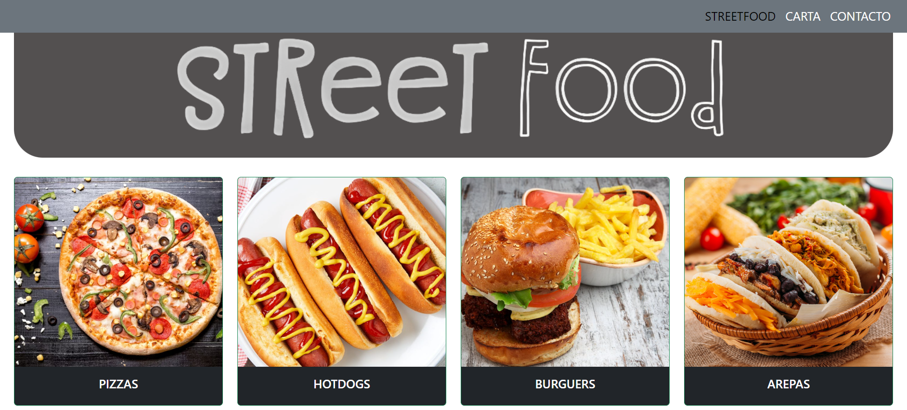

### Proyecto 2 - Carta Restaurante Digital (Street Food)

Se crea un diseño muy visual para el usuario.

#### Tecnologías utilizadas:

+ BOOTSTRAP.
+ HTML.
+ CSS.

#### Uso:

Cuenta con un menú en la parte superior derecha que cuenta con 3 botones (Inicio, Carta, Contacto).

En la página principal, encontrará información sobre el local y reseñas de algunos clientes para generar confianza.

En el apartado de Carta podrá ver todo el menú disponible.

La ventana de contacto podrá realizar la reserva.

Una vez confirmada la reserva recibe la confirmación y podrá acceder a las páginas anteriores en caso de que lo requiera.

#### Licencia y Copyright:

Se han obtenido fotos e ideas de comida en varias páginas web, entre ellas estan:

+ www.justeat.com
+ www.pequerecetas.com
+ www.tastingtable.com
+ www.freepik.es
+ www.recetasderechupete.com
+ www.nestlecocina.es
+ www.lavanguardia.com

##### Autor:

Jorge Luis Martin Lorenzo.